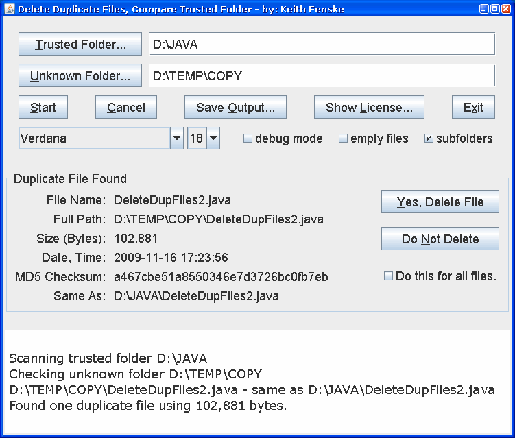

### Delete Duplicate Files (Java)

by: Keith Fenske, https://kwfenske.github.io/

DeleteDupFiles is a Java 1.4 application to compare a folder of unknown files
with files in a known good or "trusted" folder, then delete files from the
unknown folder that are already in the trusted folder. This reduces the amount
of work required to merge new files into a collection. Unknown files are
considered to be duplicates if they have the same size and the same MD5
checksum. Duplicates are not detected inside the trusted folder. The
probability of two files with different contents having the same size and MD5
checksum is extremely small.

On most systems, deleted files are permanently gone and do not appear in the
recycle bin or trash folder. There is no "undo" feature. This program is not
recommended for inexperienced users!

There is no ready-to-run ZIP file. Two changes must be made before this program
can go into general use. One is to call Desktop.moveToTrash() to delete files,
starting with Java 9 (2017). The other is to select which files are deleted,
rather than assuming the first file found is correct and all later files are
duplicates.

Released under the terms and conditions of the Apache License (version 2.0 or
later) and/or the GNU General Public License (GPL, version 2 or later).

